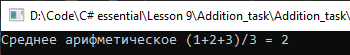

# Lesson9_addition_task
Условия задачки:
>Используя Visual Studio, создайте проект по шаблону Console Application.  
Создайте анонимный метод, который принимает в качестве параметров три целочисленных аргумента и возвращает среднее арифметическое этих аргументов. 

Подытог: вот такенный майндфак на выходе
>
